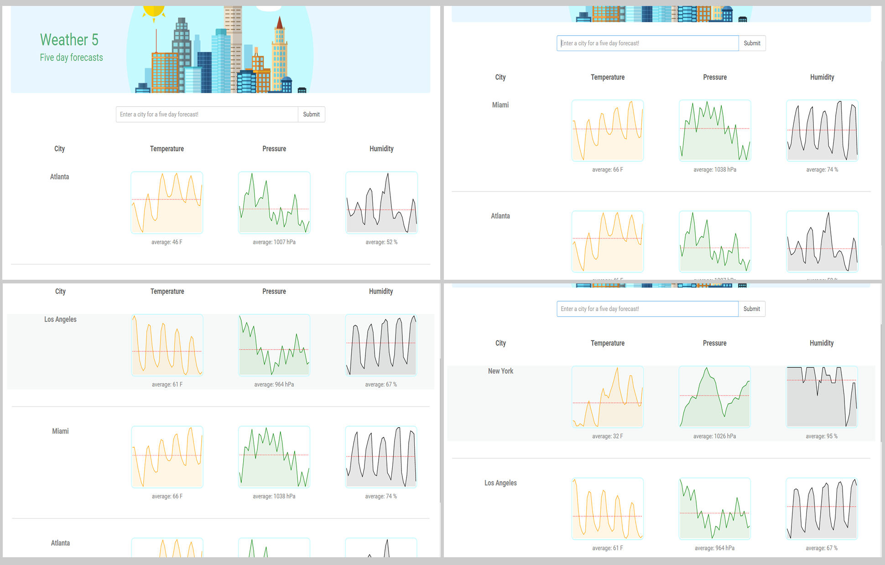
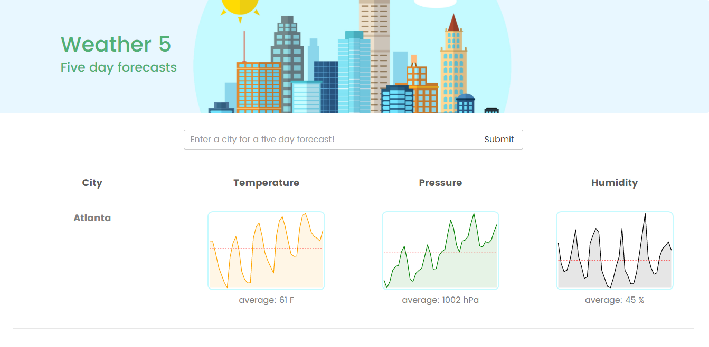

<!-- <h1>Weather 5</h1>

Third portfolio project for <a href="https://www.thinkful.com/">Thinkful</a>. <a href="https://weather5.herokuapp.com/">Weather 5</a> is a weather forecast app, designed to let users see a 5 day snapshot of the weather in a city. 

<h2>Getting Started</h2>
<h3>Installing</h3>
<ul>
	<li>Git clone https://github.com/allen30331/weather-five</li>
	<li>cd weather-five</li>
	<li>npm install</li>
</ul>

<h3>Launching</h3>
<ul>
	<li>npm run dev</li>
	<li>Then open localhost:8080 in a browser.</li>
</ul>

<h3>Testing</h3>
<ul>
	<li>npm run test</li>
</ul>

<h2>How it Works</h2>

Weather 5 gives the user a snapshot of the weather in the city they choose. After you search a city, you will see the city's name and the five day charts for the temperature, pressure and humidity for that city. Also, you will see the average temperature, pressure and humidity during those days. As you search other cities, a list of cities will compile. This is quite helpful if the user want to compare the weather of cities.

<h2>Technology</h2>
<ul>
	<li>HTML5
CSS3
Javascript
React
Redux
React-Router
Mocha + Chai
Continuous integration and deployment with Travis CI</li>
	<li>HTML5
CSS3
Javascript
React
Redux
React-Router
Mocha + Chai
Continuous integration and deployment with Travis CI</li>
	<li>HTML5
CSS3
Javascript
React
Redux
React-Router
Mocha + Chai
Continuous integration and deployment with Travis CI</li>
	<li>HTML5
CSS3
Javascript
React
Redux
React-Router
Mocha + Chai
Continuous integration and deployment with Travis CI</li>
	<li>HTML5
CSS3
Javascript
React
Redux
React-Router
Mocha + Chai
Continuous integration and deployment with Travis CI</li>
	<li>HTML5
CSS3
Javascript
React
Redux
React-Router
Mocha + Chai
Continuous integration and deployment with Travis CI</li>
	<li>HTML5
CSS3
Javascript
React
Redux
React-Router
Mocha + Chai
Continuous integration and deployment with Travis CI (testing)</li>
	<li>HTML5
CSS3
Javascript
React
Redux
React-Router
Mocha + Chai
Continuous integration and deployment with Travis CI</li>
</ul>

<h2>Responsive</h2>
<ul>
	<li>The app is fully responsive and quickly adapts to all mobile, tablet, and desktop viewports.</li>
</ul>

<h2>Image Attributions</h2>
<ul>
	<li>http://www.freepik.com/free-vector/city-illustration_796650.htm</li>
</ul> -->

# Weather 5

> [Weather 5](https://weather5.herokuapp.com/) is a weather forecast app, designed to let users see a 5 day snapshot of the weather in a city.

# Getting Started 

## Installing 

* git clone https://github.com/allen30331/weather-five
* cd weather-five
* npm install

## Launching 

* npm run dev
* then open localhost:8080 in a browser

## Testing  

* npm run test

# How it works

> Weather 5 gives the user a snapshot of the weather in the city they choose. After you search a city, you will see the city's name and the five day charts for the temperature, pressure and humidity for that city. Also, you will see the average temperature, pressure and humidity during those days. As you search other cities, a list of cities will compile. This is quite helpful if the user want to compare the weather of cities. Weather 5 uses [Open Weather Map's API](http://openweathermap.org).

# Technology

* HTML5
* CSS3
* Javascript
* React
* Redux
* React-Router
* React-sparklines
* Mocha
* Continuous integration and deployment with Travis CI

# Screenshot

> 

# Attributions 

## Images 

* http://www.freepik.com/free-vector

